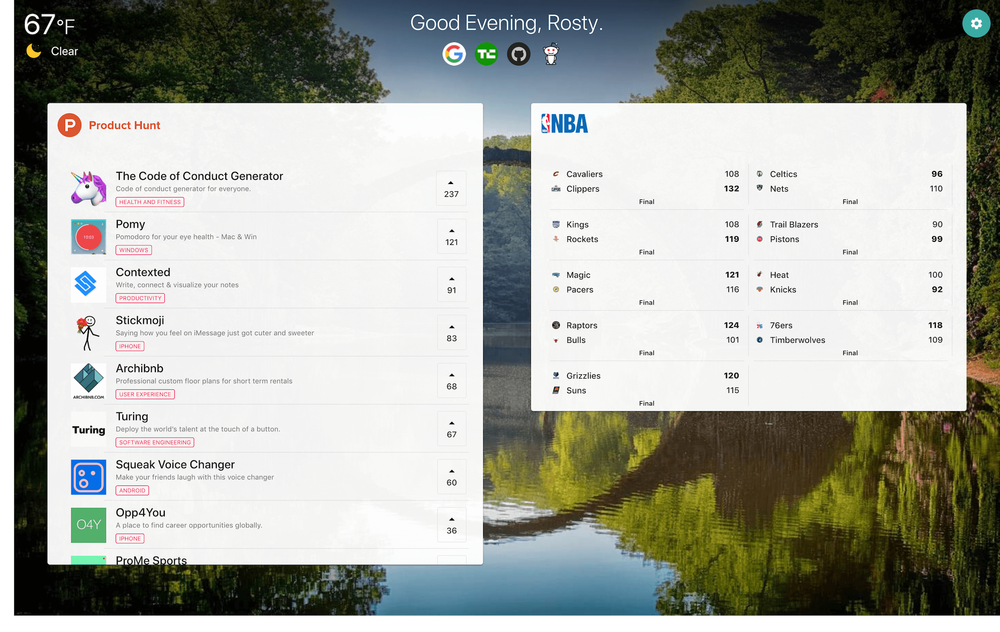

<!-- PROJECT SHIELDS -->

[![Contributors][contributors-shield]]()
[![LinkedIn][linkedin-shield]][linkedin-url]

<!-- PROJECT LOGO -->
<br />
<p align="center">
  <a href="https://github.com/rsokz/awesome-dashboard" target="_blank">
    
  </a>

  <h3 align="center">Awesome Dashboard</h3>

  <p align="center">
    Customizable web dashboard that includes news, sports data, & more!
    <br />
    <a href="https://github.com/rsokz/awesome-dashboard"><strong>View Demo »</strong></a>
  </p>
</p>

## About The Project



Awesome dashboard is a feature-rich dashboard app, personalized to your liking. The dashboard screen displays product news of the day from Product Hunt, daily NBA games information, location weather, and 4 personalized website links. Additional personalization is available for things like background images.

## Features

> dev features

- 100% function components with React Hooks
- Fully TypeScript Client
- Graphql & Mongo
- Passport authentication
- Express server
- Material UI

> user features

- Product Hunt news
- NBA information for games of the day
- Customizable top 4 websites
- Current weather report
- Customizable dashboard background

## Usage

Clone

```sh
git clone https://github.com/rsokz/awesome-dashboard.git
```

Setup

> install dependencies

```sh
yarn
```

> Start server:

```sh
yarn dev
```

## Built With

## To-Do (v2)

- [ ] Allow URL link for dashboard background image
- [ ] Additional sports feeds (NFL, NCAAF, etc.)
- [ ] Additional news feeds (Techcrunch)
- [ ] Customizable section layouting
- [ ] Convert to use Firebase (Authetication & Firestore)

<!-- Markdown link & img dfn's -->

[contributors-shield]: https://img.shields.io/badge/contributors-1-orange.svg?style=flat-square
[linkedin-shield]: https://img.shields.io/badge/-LinkedIn-black.svg?style=flat-square&logo=linkedin&colorB=555
[linkedin-url]: https://linkedin.com/in/rsokz
