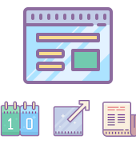

# Awesome Dashboard

> Customizable web dashboard that includes news, sports data, & more!

[![NPM Version][npm-image]][npm-url]
[![Build Status][travis-image]][travis-url]


## Live Demo

## Features

> dev features

- 100% function components with React Hooks
- Fully TypeScript
- Graphql & Mongo
- Passport authentication
- Express server
- Material UI

> user features

- Product Hunt news
- NBA information for games of the day
- Customizable top 4 websites
- Current weather report
- Customizable dashboard background

## Usage

Clone

```sh
git clone https://github.com/rsokz/awesome-dashboard.git
```

Setup

> install dependencies

```sh
yarn
```

> Start server:

```sh
yarn dev
```

## Built With

## To-Do (v2)

- [ ] Allow URL link for dashboard background image
- [ ] Additional sports feeds (NFL, NCAAF, etc.)
- [ ] Additional news feeds (Techcrunch)
- [ ] Customizable section layouting

## Meta

Your Name – [@YourTwitter](https://twitter.com/dbader_org) – YourEmail@example.com

Distributed under the XYZ license. See `LICENSE` for more information.

[https://github.com/yourname/github-link](https://github.com/dbader/)

<!-- Markdown link & img dfn's -->

[npm-image]: https://img.shields.io/npm/v/datadog-metrics.svg?style=flat-square
[npm-url]: https://npmjs.org/package/datadog-metrics
[travis-image]: https://img.shields.io/travis/dbader/node-datadog-metrics/master.svg?style=flat-square
[travis-url]: https://travis-ci.org/dbader/node-datadog-metrics
[wiki]: https://github.com/yourname/yourproject/wiki
